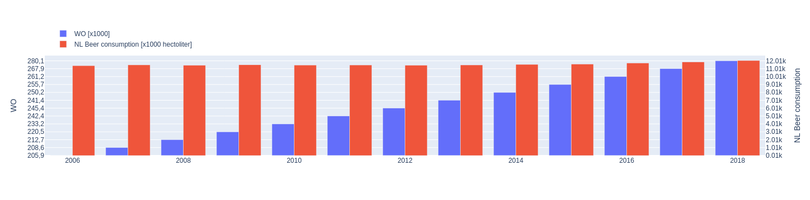

Student ID: 16944275

- Fantastic yeasts and where to find them: the hidden diversity of dimorphic fungal pathogens, MCC Van Dyke et al., 2019
- JT Harvey, Applied Ergonomics, 2002
-  Reading Acquisition, Developmental Dyslexia, and Skilled Reading Across Languages: A Psycholinguistic Grain Size Theory, DW Ziegler et al., 2005

This bar plot shows a steady linear increase for both the number of WO students and the consumption of beer in the Netherlands along the years.
We can assume a correlation between both 